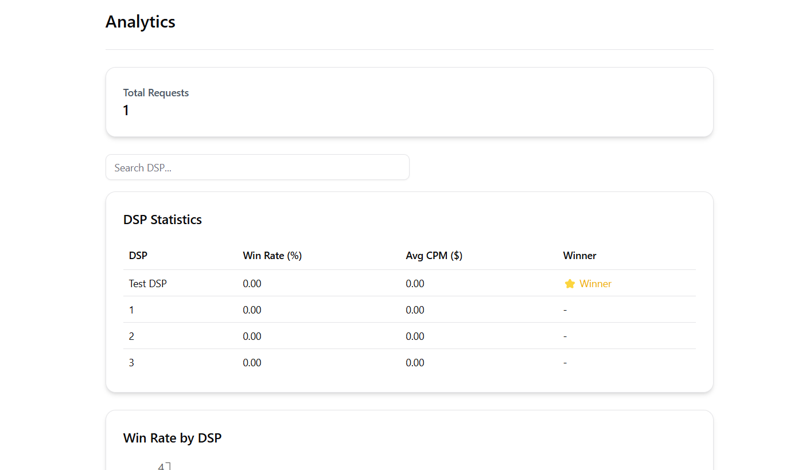

# SSP Ad Auction Simulator

This project simulates an SSP (Supply-Side Platform) Ad Auction system. It is built with a full-stack approach using **Express** (with TypeScript) for the backend, **Next.js** for the frontend, and **Prisma** for the database ORM. The system allows multiple DSPs (Demand-Side Platforms) to bid on ad slots, and the system selects the highest bid to display the ad.

## Features

- **Ad Request Simulation**: Simulate ad requests from publishers and run an auction to determine the winning DSP.
- **DSP Management**: Manage DSPs, including bid rules, creatives, and their active status.
- **Analytics**: View analytics for DSP performance, including win rates and average CPM.
- **Filters and Search**: Filter DSPs based on win rates and search for specific DSPs.
- **Responsive UI**: The frontend is responsive and built with Next.js, using ShadCN UI components for design.

## Tech Stack

- **Frontend**: Next.js (React)
- **Backend**: Express.js (Node.js with TypeScript)
- **Database**: Prisma ORM (connected to PostgreSQL or any other relational database)
- **Styling**: ShadCN UI
- **API**: RESTful API for managing ad requests, DSPs, and analytics

## Installation

### Prerequisites

- Node.js (v14 or higher)
- PostgreSQL (or other relational database supported by Prisma)

### Backend Setup

1. Clone the repository:

   ```bash
   git clone <your-repository-url>
   cd ssp-ad-auction-simulator
   ```

2. Install backend dependencies:

   ```bash
   cd backend
   npm install
   ```

3. Set up environment variables:

   Create a `.env` file in the backend folder with the following variables:

   ```env
   DATABASE_URL=<your-database-connection-url>
   NEXT_PUBLIC_BACKEND_URL=http://localhost:5000
   ```

4. Migrate the database:

   Run the following command to set up the database schema using Prisma:

   ```bash
   npx prisma migrate dev
   ```

5. Start the backend server:

   ```bash
   npm run dev
   ```

   The server should be running at `http://localhost:5000`.

### Frontend Setup

1. Install frontend dependencies:

   ```bash
   cd frontend
   npm install
   ```

2. Set up environment variables:

   Create a `.env.local` file in the frontend folder with the following variable:

   ```env
   NEXT_PUBLIC_BACKEND_URL=http://localhost:5000
   ```

3. Start the frontend server:

   ```bash
   npm run dev
   ```

   The frontend should be running at `http://localhost:3000`.

## API Endpoints

### `POST /dsps`

Create a new DSP in the system.

#### Request Body

```json
{
  "name": "Test DSP",
  "isActive": true,
  "bidRules": [
    {
      "geo": "US",
      "device": "Mobile",
      "bidPrice": "2.5"
    }
  ],
  "creatives": [
    {
      "imageUrl": "https://example.com/image.jpg",
      "clickUrl": "https://example.com/click"
    }
  ]
}
```

#### Response

```json
{
  "id": 1,
  "name": "Test DSP",
  "isActive": true,
  "bidRules": [
    {
      "geo": "US",
      "device": "Mobile",
      "bidPrice": 2.5
    }
  ],
  "creatives": [
    {
      "imageUrl": "https://example.com/image.jpg",
      "clickUrl": "https://example.com/click"
    }
  ]
}
```

### `GET /dsps`

Get a list of all DSPs in the system.

#### Response

```json
[
  {
    "id": 1,
    "name": "Test DSP",
    "isActive": true,
    "bidRules": [
      {
        "geo": "US",
        "device": "Mobile",
        "bidPrice": 2.5
      }
    ],
    "creatives": [
      {
        "imageUrl": "https://example.com/image.jpg",
        "clickUrl": "https://example.com/click"
      }
    ]
  }
]
```

### `POST /ad-request`

Simulate an ad request and run the auction.

#### Request Body

```json
{
  "publisher_id": 1,
  "ad_slot_id": 1,
  "geo": "US",
  "device": "Mobile",
  "time": "2025-04-25T12:00:00Z"
}
```

#### Response

```json
{
  "winner_dsp": "Test DSP",
  "bid_price": 2.5,
  "creative": {
    "imageUrl": "https://example.com/image.jpg",
    "clickUrl": "https://example.com/click"
  }
}
```

## Frontend Screens

- **DSP Management**: Create, view, and manage DSPs and their bid rules.
- **Ad Request Simulation**: Send ad requests and simulate the auction process.
- **Analytics**: View statistics such as win rates and average CPM for each DSP.
- **Filters and Search**: Filter DSPs by win rate and search for specific DSPs.

## Architecture & Flow Explanation
## Architecture
The system is divided into two main components:
### Backend:
- Built with Express.js and TypeScript.
- Handles API requests for DSP management, ad requests, and analytics.
- Uses Prisma ORM to interact with a relational database.
### Frontend:
- Built with Next.js (React framework).
- Provides a responsive UI for managing DSPs, simulating ad requests, and viewing analytics.

## Flow
### DSP Management:
- Users can create, update, and delete DSPs.
- Each DSP has bid rules and creatives associated with it.
### Ad Request Simulation:
- A publisher sends an ad request with details like geo, device, and ad_slot_id.
- The backend runs an auction to determine the winning DSP based on bid rules.
### Analytics:
- The frontend displays performance metrics for DSPs, such as win rates and average CPM.

## Screenshots of the Dashboard
### Home


### DSP Management


### Ad Request Simulation


### Analytics


### Create New DSP


## Contributing

Feel free to fork the repository, make improvements, and create a pull request. Contributions are welcome!

## License

This project is licensed under the MIT License - see the [LICENSE](LICENSE) file for details.
